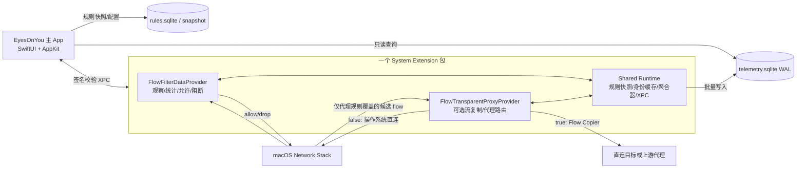

# EyesOnYou：macOS 原生网络可观测、防火墙与选择性代理开发规格

**版本：** v0.1 架构基线  
**日期：** 2026-07-24  
**状态：** 可进入 Phase 0 API 校准；尚未在 Xcode/真实 macOS 上编译验证  
**工作代号：** EyesOnYou  
**建议最低系统：** macOS 13  
**实现语言：** Swift 6 语言模式，少量 C/Objective-C 互操作仅用于系统结构与兼容封装  
**核心框架：** NetworkExtension、SystemExtensions、Network、Security、SystemConfiguration、CFNetwork、SQLite3、SwiftUI、AppKit、OSLog

---

## 1. 一页结论

本项目不应以 `nettop` 轮询、`pf`、BPF 抓包、内核扩展或全量 Packet Tunnel 为核心。推荐方案是：

1. 使用 `NEFilterDataProvider` 观察每条 socket flow，获得来源 App 身份、目的端点、协议、方向以及系统提供的流量统计报告；在同一热路径中执行 allow/drop 决策。
2. 使用可选的 `NETransparentProxyProvider` 对命中的 flow 做“流复制”，从而让特定 App/服务直连或走指定上游代理。透明代理不启用时，数据面完全不经过我们的用户态转发。
3. 主 App 只做安装、配置、规则编辑、实时展示和历史查询。主 App 退出后，system extension 继续工作。
4. 所有防火墙规则与代理路由规则使用同一套 App/目的地匹配模型，但由两个 Provider 分别执行：
   - Filter Provider：`observe / allow / block`
   - Proxy Provider：`direct / system / http-connect / socks5`
5. 只采集元数据和计数，不读取应用载荷，不解密 TLS，不安装根证书。
6. SQLite 直接使用 C API，采用 WAL、单写者、批量合并和多级时间桶。热路径禁止同步磁盘 IO、DNS、图标解析和 UI 通信。
7. 默认发布为一个 `.systemextension` 包，内部映射两个 Provider 类；模块逻辑分离，代理默认关闭。这样可减少安装对象和常驻进程数。

### 1.1 为什么这是最合适的路线

`NEFilterDataProvider` 是 Apple 为内容过滤和个人防火墙场景提供的公共 API。它能在 flow 创建时给出来源应用信息，并让 Provider 返回允许或丢弃 verdict；`statisticsReportFrequency` 可请求后续统计报告。`NETransparentProxyProvider` 则是 Apple 明确提供的 flow-copy 方案：对某条 flow 返回 `false` 时交给操作系统正常处理，返回 `true` 时由 Provider 接管并负责转发。因此它天然适合“只有命中的 App/服务才走代理”。

这种拆分避免了最昂贵的设计：为了统计所有 App 流量而让所有字节都经过自建代理或 VPN。正常情况下，Filter Provider 只处理连接元数据和统计计数；只有用户主动开启选择性代理且规则命中的 flow 才被复制到用户态。

---

## 2. 产品目标与非目标

### 2.1 产品目标

| 编号 | 目标 | 验收描述 |
|---|---|---|
| G-01 | 实时按 App 排名 | 展示当前上传/下载速率、累计字节、活动连接数，UI 可在 250–1000 ms 周期刷新 |
| G-02 | 历史统计 | 支持 1 小时、24 小时、7 天、30 天、自定义范围；按 App、服务、路由方式聚合 |
| G-03 | App 防火墙 | 按 App 全局或 App+服务规则允许/阻断新连接 |
| G-04 | 服务规则 | 支持域名精确/后缀、IPv4/IPv6、CIDR、端口区间、TCP/UDP、方向 |
| G-05 | 代理识别 | 对每条连接展示“已确认走自有代理 / 匹配系统代理 / 很可能走本地代理 / 未知” |
| G-06 | 选择性代理 | 指定 App/服务可选择直连、系统/PAC、HTTP CONNECT、SOCKS5 |
| G-07 | 原生体验 | SwiftUI + AppKit；系统设置、菜单栏、辅助功能、深浅色、键盘导航符合 macOS 习惯 |
| G-08 | 小巧高效 | UI 关闭时低 CPU、低 RSS；无逐包解析；无每事件一条数据库写入 |
| G-09 | 隐私 | 默认不保存载荷、URL path、DNS 内容；主机名可配置降级为注册域或哈希 |
| G-10 | 可开源 | 构建、测试、签名和发行流程文档化；核心规则和存储模块可单独测试 |

### 2.2 非目标

第一版明确不做：

- TLS 中间人解密、根证书安装、证书固定绕过；
- HTTP body、Cookie、Authorization Header 或用户内容采集；
- 恶意软件防护、行为检测或本机管理员对抗；
- 用私有 API 获取任意进程内部网络状态；
- 还原安装前的历史流量；
- 在 hostname 缺失时声称已经确定某个 IP 属于哪个在线服务；
- 第一版完整支持 UDP 代理、QUIC 代理和 SOCKS5 UDP Associate；
- 第一版“每次未知连接弹窗等待用户选择”。

### 2.3 关键产品边界

1. **服务不是 URL。** 对普通 socket flow，可靠的服务匹配单位是 hostname（如果系统提供）、IP/CIDR、端口和协议。HTTPS path 在不解密的情况下不可见。Apple 的 URL Filter API 是另一个隐私保护型过滤体系，覆盖 WebKit/URLSession，不是通用流量计量或代理路由替代品。
2. **代理识别存在确定性等级。** 自己的 Transparent Proxy 能确定；系统代理配置能形成高置信度判断；App 内置 VPN/加密代理、QUIC 隧道或自定义协议可能只能标记未知。
3. **来源 App 和实际创建 socket 的进程可能不同。** 系统服务可能代表 App 建立连接。需要同时保留 `sourceAppAuditToken` 和 `sourceProcessAuditToken`，UI 默认归属来源 App，并可展开显示实际进程。
4. **Content Filter 可能与同类产品冲突。** 启用 `NEFilterManager.isEnabled` 会禁用系统中其他 Network Content Filter。安装流程必须提前告知用户，并在诊断页显示冲突。
5. **系统扩展不是普通沙盒 App。** 首次启用需要用户批准；发行必须正确签名和公证。卸载、更新和回滚必须作为一等功能设计。

---

## 3. 技术方案比较与淘汰理由

| 方案 | App 归因 | 实时流量 | 阻断 | 选择性代理 | 性能/维护 | 结论 |
|---|---:|---:|---:|---:|---|---|
| `nettop` 文本/私有接口轮询 | 中 | 中 | 否 | 否 | 易受系统变化、代理归因失真 | 只用于开发校验，不做产品核心 |
| Activity Monitor/libproc | 低到中 | 中 | 否 | 否 | 缺少稳定历史和完整 socket 身份 | 不采用 |
| `pf` | 低 | 高 | 是 | 部分 | 不能可靠按签名 App 匹配，系统兼容风险 | 不采用 |
| BPF/逐包抓取 | 低 | 高 | 复杂 | 复杂 | 逐包开销、隐私风险、归因困难 | 不采用 |
| KEXT | 高 | 高 | 是 | 是 | 不符合现代 macOS 路线 | 禁止采用 |
| EndpointSecurity | 高 | 不适合字节计量 | 间接 | 否 | 额外受限 entitlement；不是网络数据面 | 不采用 |
| Packet Tunnel | 通常弱于 flow API | 高 | 是 | 是 | 所有数据经过用户态，复杂且较重 | 除非以后做 VPN，不采用 |
| `NEFilterDataProvider` | 高 | 高（统计报告） | 是 | 否 | 公共 API、无载荷转发 | **监控/防火墙核心** |
| `NETransparentProxyProvider` | 高 | 仅接管 flow | 可终止但不作为主防火墙 | 是 | 命中才复制，适合按规则分流 | **可选代理核心** |

### 3.1 不把阻断放进代理模块

透明代理虽可接管并关闭 flow，但它不应成为防火墙的唯一执行点：

- 没有启用代理时仍需阻断；
- 防火墙 verdict 应尽早返回，避免创建代理会话；
- allow/drop 与 direct/proxy 是两个不同维度；
- 两层职责分离更容易测试和保证 fail-open/fail-closed 行为。

---

## 4. 总体架构

### 4.1 运行时组件



### 4.2 一个 system extension 包、两个 Provider 类

默认选择一个 system extension 包，理由：

- 少一次系统扩展安装/批准对象；
- 少一个可执行文件、签名对象和更新路径；
- 共享 App 身份缓存、规则快照、聚合器和 XPC listener；
- 代理配置关闭时，Transparent Proxy Provider 不被启动，不产生 flow-copy 开销。

模块必须仍然保持依赖方向：

```text
FilterProvider  ─┐
                 ├─> Core / RuleEngine / Telemetry / IPC
ProxyProvider   ─┘

FilterProvider  X  ProxyProvider  （禁止直接互相持有）
```

如实机测试发现代理异常会频繁拖垮整个 system extension 进程，则增加 `SplitProviders` 构建配置，将两个 Provider 放入独立 `.systemextension` 包。这个选择不应改变核心模块 API。

### 4.3 Xcode target 建议

```text
EyesOnYou.xcworkspace
├─ EyesOnYouApp                     macOS Application
├─ EyesOnYouNetworkExtension        Network Extension System Extension
│  ├─ FlowFilterDataProvider
│  └─ FlowTransparentProxyProvider
├─ EyesOnYouCore                    Swift Package / Framework
├─ EyesOnYouRuleEngine              Swift Package
├─ EyesOnYouStorage                 Swift Package
├─ EyesOnYouIPC                     Swift Package
├─ EyesOnYouProxyCore               Swift Package
├─ EyesOnYouTestSupport             Test helpers
├─ EyesOnYouCoreTests
├─ EyesOnYouRuleEngineTests
├─ EyesOnYouStorageTests
├─ EyesOnYouProxyCoreTests
└─ EyesOnYouIntegrationTests
```

建议核心包保持 Foundation-only 或尽可能少依赖 AppKit，便于命令行测试和未来复用。NetworkExtension 类型在边界层转换为纯 Swift 值类型，避免让规则引擎依赖系统对象。

### 4.4 运行模式

| 模式 | Filter | Proxy | 行为 |
|---|---|---|---|
| 监控模式 | 启用，全部 allow | 关闭 | 实时/历史统计 |
| 防火墙模式 | 启用，规则 allow/drop | 关闭 | 统计 + 阻断 |
| 代理观察模式 | 启用 | 关闭 | 读取系统代理并做置信度判断，不主动接管 |
| 选择性代理模式 | 启用 | 启用 | Filter 先判防火墙；Proxy 再判 direct/proxy |
| Lockdown 模式 | 启用，默认 block | 可选 | 高安全用户手动开启；普通用户不默认 |

---

## 5. App 身份模型

### 5.1 不能只用 PID 或路径

PID 会复用，路径会变化，App 更新后二进制哈希变化，Helper/XPC Service 又可能位于 App bundle 内。稳定身份应由签名信息主导：

```swift
struct AppIdentityKey: Hashable, Codable, Sendable {
    let teamIdentifier: String?       // Apple Team ID；未签名时为 nil
    let signingIdentifier: String     // 主键核心，例如 com.vendor.product
}

struct AppBuildIdentity: Hashable, Codable, Sendable {
    let app: AppIdentityKey
    let codeDirectoryHash: Data?      // 每个 build 变化，用于检测版本替换
    let bundleVersion: String?
}
```

推荐规则主键：`teamIdentifier + signingIdentifier`。`sourceAppUniqueIdentifier`/Code Directory Hash 只作为 build 指纹，不作为永久规则唯一键，因为应用升级会变化。

### 5.2 每条 Flow 保存两套来源

```swift
struct SourceIdentity: Sendable {
    let attributedApp: AppIdentityKey       // source app
    let attributedAuditToken: Data?
    let creatingProcessAuditToken: Data?    // 实际创建 flow 的进程
    let processID: pid_t?
    let executablePath: String?
    let parentBundlePath: String?
    let codeDirectoryHash: Data?
    let isAppleSigned: Bool?
    let isAdHocOrUnsigned: Bool
}
```

UI 默认显示 `attributedApp`，详情中显示：

```text
归属 App：Safari
实际进程：com.apple.WebKit.Networking
来源判断：系统服务代表 Safari 建立连接
```

### 5.3 身份解析流程

热路径只读取 NetworkExtension 已提供的标识和 audit token，解析结果先放入缓存；Security framework 的完整代码签名解析可以异步完成。

1. 读取 `sourceAppIdentifier` 或 proxy flow metadata 的 signing identifier。
2. 读取 source app/process audit token。
3. 用 audit token 构建动态 `SecCode`，提取 Team ID、签名标识、CDHash、路径。
4. 校验动态签名有效性。
5. 以 `audit token + process start time` 作为短期缓存键，避免 PID 复用。
6. 用 `team + signingID` 归并长期 App 记录。
7. 对 App bundle 内 Helper 记录 `parent_bundle_id`，UI 可选择“按产品聚合”或“按可执行文件展开”。

### 5.4 未签名和脚本进程

未签名二进制使用退化键：

```text
adhoc:<sha256(normalized executable path + file identity + cdhash if any)>
```

规则 UI 必须标记“路径型规则，文件替换后可能失效或需要重新确认”。不要无条件信任同一路径的新二进制。

---

## 6. Flow 数据模型与生命周期

### 6.1 纯值类型描述

```swift
struct FlowDescriptor: Hashable, Sendable {
    let id: UUID
    let openedAt: ContinuousClock.Instant
    let wallClockOpenedAt: Date
    let source: SourceIdentitySummary
    let direction: FlowDirection
    let transport: TransportProtocol
    let remoteHost: String?           // 系统提供时才有
    let remoteAddress: IPAddress?
    let remotePort: UInt16?
    let localAddress: IPAddress?
    let localPort: UInt16?
    let interfaceType: InterfaceType?
}
```

不要把 `NEFilterFlow`、`NEAppProxyFlow` 或 `NWEndpoint` 直接传入规则引擎和数据库层。

### 6.2 生命周期事件

```text
newFlow
  ├─ blockedImmediately -> 记录 attempt，结束
  └─ allowed
       ├─ statistics(report cumulative bytes)
       ├─ statistics(...)
       └─ flowClosed(final counts / reason)
```

聚合器对每条 flow 保存最后一次累计计数：

```swift
let deltaUp = currentUp >= previousUp ? currentUp - previousUp : currentUp
let deltaDown = currentDown >= previousDown ? currentDown - previousDown : currentDown
```

计数下降按“系统计数重置/flow 状态重建”处理，并增加诊断计数。严禁直接把每次累计值累加，否则会严重重复计量。

### 6.3 必须做的字节语义校准

Apple 文档明确提供 `statisticsReportFrequency` 和 `NEFilterReport.Event.statistics`，`NEFilterReport` 也有入站/出站字节字段；但不同文档页面和 SDK 版本对“何时非零”的描述可能不完全一致。因此 Phase 0 必须在每个最低支持系统和当前系统上验证：

- statistics 事件是否持续提供累计字节；
- TCP/UDP 的计数是否包含协议头；
- close report 是否重复最后一次 statistics 值；
- blocked flow 是否产生 report；
- sleep/wake 后计数是否重置；
- localhost、代理链和长连接的行为。

如果某个 OS 只在 close 时提供可靠字节数，该 OS 的 UI 必须标注“连接关闭后结算”，不能伪造秒级实时值。

### 6.4 活跃 Flow Registry

使用 16 或 32 个分片，按 UUID 哈希选择分片：

```swift
final class FlowRegistry: @unchecked Sendable {
    private struct Shard {
        let lock = OSAllocatedUnfairLock(initialState: [UUID: FlowState]())
    }
    private let shards: [Shard]
}
```

目标：

- 新 flow 查找/更新不经过单一全局锁；
- 热路径不创建 `Task`、不跨 actor hop、不执行 `DispatchQueue.async` 小任务风暴；
- 状态对象只保存计量所需字段；图标、App 名、地理信息在 UI/后台层解析。

---

## 7. Content Filter Provider 设计

### 7.1 启动配置

Filter Provider 的 `startFilter` 应安装非常少的系统级 `NEFilterRule`：通常一个覆盖出站 socket flow 的 broad rule，加必要的 loopback 处理。系统 `NEFilterSettings` 最多 1000 条规则，因此不要把所有用户规则翻译为系统规则。用户规则应编译到 Provider 内部的只读快照中。

```text
系统级规则：决定哪些 flow 送到 Provider
内部规则：决定 allow / block / observe
```

### 7.2 热路径约束

`handleNewFlow` 中允许的操作：

- 读取现成 metadata；
- 常量时间 App 查找；
- 域名/IP trie 查找；
- 端口/协议判断；
- 更新内存计数；
- 返回 verdict。

禁止：

- SQLite/文件 IO；
- DNS 正向或反向查询；
- `NSWorkspace`、图标加载；
- 同步 XPC；
- 等待主 App；
- 正则表达式；
- 网络请求；
- 大量字符串标准化和日志格式化。

### 7.3 决策顺序

```text
1. 解析最小 FlowDescriptor
2. 检查自身/系统必要流量豁免
3. RuleSnapshot.evaluateFirewall(flow)
4. 记录 new-flow attempt
5. block -> drop verdict
6. allow -> allow verdict + 设置统计报告频率
7. 返回
```

### 7.4 默认行为

普通模式默认 `allow`。原因：

- system extension 更新或规则文件损坏时不应让整台 Mac 断网；
- 开源工具的第一责任是可恢复；
- 高安全用户可显式开启 Lockdown/default-block。

Provider 无法加载规则快照时：

1. 使用内嵌的 last-known-good 快照；
2. 若仍失败，进入 fail-open；
3. 写入结构化诊断；
4. 向 App 发状态通知；
5. 菜单栏显示醒目但不阻塞网络的错误状态。

### 7.5 不在 v1 使用 pause/ask

未知连接弹窗通常要求 `pause` flow，等待 UI 决策后恢复。它会引入：

- UI 未运行、用户未登录或快速用户切换；
- 暂停 flow 泄漏；
- App 退出或 XPC 中断；
- 连接超时和启动死锁；
- 大量并发弹窗。

第一版采用静态规则和默认策略。以后加入 Ask 模式时必须：

- 硬超时，例如 5 秒；
- 普通模式超时 fail-open，Lockdown 模式可选 fail-closed；
- 同一 App/目的地合并弹窗；
- Provider 自己维护 paused-flow 上限；
- UI 断开时立即恢复所有暂停 flow。

### 7.6 统计频率策略

建议提供三个档：

| 档位 | 新 flow 统计频率 | 用途 |
|---|---|---|
| 节能 | `.low` | UI 关闭、后台长期运行 |
| 平衡 | `.medium` | 默认实时仪表盘 |
| 精细 | `.high` | 用户短时间打开连接调试页 |

频率是对 verdict/flow 设置的，已存在的连接未必会立即改变。因此切换档位只保证新建 flow 使用新频率，UI 应避免暗示所有旧连接瞬间升级采样率。

### 7.7 Filter Provider 参考骨架

完整草案见 `examples/FlowFilterDataProvider.swift`。核心形态：

```swift
final class FlowFilterDataProvider: NEFilterDataProvider {
    override func handleNewFlow(_ flow: NEFilterFlow) -> NEFilterNewFlowVerdict {
        let descriptor = descriptorFactory.make(from: flow)
        let decision = runtime.rules.current.evaluateFirewall(descriptor)
        runtime.telemetry.recordOpen(descriptor, decision: decision)

        switch decision.action {
        case .block:
            return .drop()
        case .allow, .observe:
            let verdict = NEFilterNewFlowVerdict.allow()
            verdict.statisticsReportFrequency = runtime.statisticsFrequency
            return verdict
        }
    }

    override func handle(_ report: NEFilterReport) {
        runtime.telemetry.consume(report)
    }
}
```

注意：示例是设计骨架，不替代当前 Xcode SDK 的签名检查；Phase 0 要以自动补全和实际编译结果修正方法名与可用性标注。

---

## 8. 统一规则模型

### 8.1 一条规则包含两个独立动作维度

```swift
struct NetworkPolicyRule: Identifiable, Codable, Sendable {
    let id: UUID
    var enabled: Bool
    var priority: Int32
    var app: AppMatcher
    var destination: DestinationMatcher
    var ports: PortMatcher
    var transport: TransportMatcher
    var direction: DirectionMatcher
    var schedule: ScheduleMatcher?
    var firewall: FirewallAction
    var route: RouteAction
    var note: String?
    var createdAt: Date
    var modifiedAt: Date
}

enum FirewallAction: Codable, Sendable {
    case inherit
    case observe
    case allow
    case block
}

enum RouteAction: Codable, Sendable {
    case inherit
    case direct
    case systemProxy
    case proxy(profileID: UUID)
}
```

例如：

```text
App = com.example.downloader
Destination = *.githubusercontent.com:443/TCP
Firewall = allow
Route = proxy("Office SOCKS5")
```

### 8.2 匹配器

```swift
enum AppMatcher {
    case any
    case exact(AppIdentityKey)
    case productGroup(String)       // UI 归组，不建议作为底层安全主键
    case appleSigned
    case unsigned
}

enum DestinationMatcher {
    case any
    case hostnameExact(String)
    case hostnameSuffix(String)
    case ip(IPAddress)
    case cidr(IPNetwork)
}

enum PortMatcher {
    case any
    case exact(UInt16)
    case range(ClosedRange<UInt16>)
    case set([UInt16])
}
```

hostname 标准化：小写、去末尾点、IDNA/Punycode 统一、拒绝空 label。后缀匹配必须按 label 边界，不允许 `badexample.com` 错误命中 `example.com`。

### 8.3 优先级

推荐确定性顺序：

1. 显式 `priority` 更高；
2. App exact 优于 any；
3. hostname exact 优于 suffix，IP exact 优于 CIDR；
4. 更长域名后缀/更长 CIDR 前缀更具体；
5. 精确端口优于区间，区间优于 any；
6. 精确协议优于 any；
7. `modifiedAt` 不参与安全决策；最终以 UUID 字节序作为稳定 tie-break。

不要采用“最后创建的规则获胜”，因为导入、同步和数据库重建会改变顺序。

### 8.4 编译后的只读结构

```text
RuleSnapshot
├─ appExact: HashMap<AppIdentityKey, AppRuleSet>
├─ appAny: AppRuleSet
├─ domainTrie: reversed-label trie
├─ ipv4Radix: prefix trie
├─ ipv6Radix: prefix trie
├─ portIndex: compact intervals / bitset for common ports
└─ metadata: version, checksum, generatedAt
```

域名反向 trie 示例：

```text
com
└─ example
   ├─ * suffix rule for example.com
   └─ api exact rule for api.example.com
```

规则编辑时在主 App 后台编译，完成后原子替换 snapshot 文件；Provider 校验版本和 SHA-256 后一次性加载。不要在 Provider 中增量修改复杂索引。

### 8.5 规则快照发布协议

1. App 写 `rules.snapshot.tmp`；
2. `fsync` 文件；
3. 写入 header：magic、schema version、generation、payload length、SHA-256；
4. 原子 rename 为 `rules.snapshot`；
5. 通过 XPC 发送 `installRules(generation, checksum)`；
6. Provider 自行从 App Group 打开并校验；
7. 成功后返回已安装 generation；
8. App 只有收到确认才把规则标记为“已生效”。

---

## 9. 选择性代理设计

### 9.1 选择 Transparent Proxy，而不是普通 App Proxy

普通 `NEAppProxyProvider` 的配置通常与受管的 Per-App VPN 规则相关，并且对 `handleNewFlow` 返回 `false` 会丢弃 flow。`NETransparentProxyProvider` 在 macOS 11 以后支持 flow copying：

- 返回 `false`：让操作系统正常处理，等价于 direct；
- 返回 `true`：Provider 接管，必须打开 flow、连接目标/上游并双向复制。

这正好对应我们的 route action。

### 9.2 Proxy Provider 决策

```text
handleNewFlow
  1. 构建 FlowDescriptor
  2. 检查防循环豁免
  3. RouteSnapshot.evaluate(flow)
  4. direct/inherit -> return false
  5. proxy(profile) -> 创建 bounded FlowCopySession，return true
  6. 失败策略：按 profile 配置 fail-open 或 fail-closed
```

默认 profile 失败策略应是 fail-open，但“公司强制代理”等高级 profile 可配置 fail-closed。两者必须在 UI 中显式区分。

### 9.3 支持的上游类型

第一阶段：

- Direct；
- System/PAC；
- HTTP proxy + CONNECT；
- SOCKS5 TCP（无认证、用户名密码）；
- 本机代理端点（Clash、Surge、SSH dynamic forward 等），仍按 HTTP/SOCKS 协议处理。

以后：

- SOCKS5 UDP Associate；
- 自定义 WireGuard/QUIC 隧道；
- 多上游健康检查和故障转移；
- 远程规则订阅。

### 9.4 TCP Flow Copier

每条被接管的 TCP flow 建立一个有限状态机：

```text
created
  -> openingApplicationSide
  -> connectingUpstream
  -> handshakingProxy      (可选)
  -> relaying
  -> halfClosedLocal / halfClosedRemote
  -> closing
  -> closed
```

原则：

- `NEAppProxyTCPFlow` 初始是未打开状态；
- 上游使用 `NWConnection`；
- 建立 NWConnection 时调用 flow 的 `setMetadata(on:)`，尽可能保留来源 App 元数据并避免后续 Provider 丢失归因；
- 双向泵必须有 backpressure；
- 每方向最多缓存 64–256 KiB，可按吞吐测试调整；
- 一个写完成后再继续读，不把整条流读入内存；
- 处理 TCP half-close；
- 状态转换必须幂等，任何错误只关闭一次；
- Provider stop 时取消全部 session，并保证 completion handler 被调用。

伪代码：

```swift
func pumpAppToUpstream() {
    appFlow.readData { data, error in
        guard let data, !data.isEmpty else {
            upstream.send(content: nil, contentContext: .finalMessage,
                          isComplete: true, completion: .contentProcessed { _ in })
            return
        }
        upstream.send(content: data, completion: .contentProcessed { sendError in
            if sendError == nil { self.pumpAppToUpstream() }
            else { self.close(sendError) }
        })
    }
}
```

实际实现需根据当前 SDK 的 TCP flow read/write API 调整；不要在未编译验证的情况下复制此伪代码到生产。

### 9.5 HTTP CONNECT

对任意 TCP 目标建议使用 CONNECT：

```text
CONNECT host:port HTTP/1.1\r\n
Host: host:port\r\n
Proxy-Authorization: Basic ...   // 仅需要时
\r\n
```

只解析代理响应的状态行和 header 终止位置，不解析用户 TLS/HTTP 载荷。成功条件通常为 2xx。限制：某些 HTTP 代理只允许 CONNECT 到 443 或白名单端口，profile 应支持可用端口测试。

### 9.6 SOCKS5

实现 RFC 1928/RFC 1929 最小子集：

1. method negotiation；
2. 可选用户名密码认证；
3. `CONNECT` command；
4. IPv4、IPv6、domain target；
5. 检查 reply code；
6. 成功后进入原始字节 relay。

协议解析必须使用有界状态机，拒绝超长域名、非法地址类型和不完整帧。凭据从 Keychain 读取，数据库只保存 persistent reference 或逻辑 credential ID。

### 9.7 UDP/QUIC 为什么后做

UDP 不是简单的双向字节流，需要：

- datagram 边界；
- 每目标映射；
- 空闲超时和 NAT 状态；
- SOCKS5 UDP encapsulation；
- DNS 特殊处理；
- QUIC 迁移、0-RTT 和多路复用测试。

v1 遇到 UDP route action：

- 默认 direct；或
- profile 可设置 block；
- UI 明确显示“此代理配置暂不支持 UDP，已按 fallback 处理”。

不要静默改变行为。

### 9.8 防循环设计

必须在 Transparent Proxy 的 included/excluded network rules 和内部逻辑双重排除：

- 自己 system extension 的 signing identifier；
- 上游代理 IP/端口；
- App ↔ Provider 控制通道；
- App Group/本地诊断服务；
- 必要 loopback；
- 已由 flow metadata 标记为代理上游的 NWConnection；
- captive portal/DHCP 等系统必要流量按 Apple API 实际行为测试。

如果上游域名会动态解析，解析结果更新时要原子刷新排除集合。连接上游本身再次被透明代理截获会造成递归、CPU 飙升和网络中断，这是发布阻断级缺陷。

### 9.9 DNS 与域名规则

可使用的 hostname 来源优先级：

1. NetworkExtension flow metadata 提供的 remote hostname；
2. connect-by-name endpoint；
3. App 自己连接的 IP，无 hostname；
4. 仅作为展示增强的反向 DNS/历史 DNS 关联，不可作为安全决策唯一依据。

默认不运行 DNS Proxy。原因是增加 Provider、系统冲突、隐私面和维护成本。只有在后续确认“IP-only flow 的服务归属”是核心需求时，才设计独立 DNS 模块，并且仍不能保证 DoH/DoQ 和应用内解析可见。

### 9.10 Filter 与 Proxy 的计数去重

默认把 **Filter Provider 看到的原始来源 flow** 作为用户流量的唯一权威计量来源。Proxy Provider 只记录路由决策、握手延迟、失败原因和可选的 relay 诊断计数，不直接把 relay 字节写入全局 `traffic_buckets`。原因是：

- Transparent Proxy 为上游建立的 `NWConnection` 可能再次出现在 Filter；
- 同一用户数据可能同时出现在原始 flow、Provider relay 和上游 socket；
- 若三处都累计，会产生 2 倍或 3 倍流量。

去重策略：

1. Filter 遇到本 system extension 自己创建的上游连接时，按 signing identifier、flow metadata 标记和上游 endpoint 排除出用户总量；
2. Proxy Provider 为每个接管 session 生成 `route_session_id`，只写 `route_events`；
3. Provider 内部可维护 `relay_bytes_up/down`，但它属于诊断指标，不参与默认 App 历史总量；
4. Phase 0 对比原始 flow id、source metadata、目标 endpoint 和开始时间，确认不同 OS 的回调顺序；
5. 如果某个 OS 的 Filter statistics 不可靠，才允许按兼容矩阵对该 OS 使用 Proxy relay 计数作为替代，并且同一 flow 只能选择一个 accounting source。

建议的相关键不是安全主键，只用于诊断：

```text
app identity + transport + original destination + start monotonic time window
```

禁止仅凭远端 IP/端口关联，因为大量连接可能同时访问同一 CDN endpoint。

### 9.11 系统代理与 PAC

“路由到系统代理”不能简单依赖 Transparent Proxy 自己的 network settings；Provider 应读取并解释当前代理配置：

- `CFNetworkCopySystemProxySettings()`；
- `SCDynamicStoreCopyProxies()`；
- 对给定 URL/host 使用 `CFNetworkCopyProxiesForURL` 或 PAC 执行 API；
- 应用 bypass list 和 simple-hostname 规则；
- 把结果转换为 Direct/HTTP/HTTPS/SOCKS profile。

PAC 结果要按 `(network configuration generation, scheme, host, port)` 缓存并设置短 TTL。PAC 执行不允许发生在 Filter `handleNewFlow` 热路径；应在 Proxy Provider 的独立解析队列/actor 中完成，并有超时和 fallback。

---

## 10. “是否走代理”的判定模型

绝不能只显示一个未经限定的布尔值。建议：

```swift
enum ProxyRouteEvidence: Codable, Sendable {
    case ownTransparentProxy(profileID: UUID)    // certain
    case matchedConfiguredProxy(endpoint: Endpoint, source: ProxyConfigSource)
    case pacSelected(endpoint: Endpoint)
    case loopbackProxyHeuristic(endpoint: Endpoint, owner: AppIdentityKey?)
    case vpnOrTunnelDetected(interface: String?)
    case applicationManagedProxySuspected
    case directObserved
    case unknown
}

enum Confidence: Int, Codable {
    case unknown = 0
    case low = 25
    case medium = 50
    case high = 75
    case certain = 100
}
```

### 10.1 判断等级

| UI 文案 | 条件 | 置信度 |
|---|---|---:|
| 已通过 EyesOnYou 代理 | Transparent Proxy session 已建立 | 100 |
| 已直连（由 EyesOnYou 决定） | Proxy Provider 对该 flow 返回 direct | 100，限于本层决定 |
| 匹配系统代理端点 | 实际远端等于当前系统代理 endpoint | 75–90 |
| PAC 为此目标选择了代理 | PAC 计算结果与实际 endpoint 一致 | 80–95 |
| 很可能通过本地代理 | 远端是 127.0.0.1/::1 的已知监听端口，并解析到代理 App | 70–90 |
| 可能通过 VPN/隧道 | 路由接口/系统配置显示 tunnel，但无法解析内部链路 | 40–70 |
| 未知 | App 自建加密隧道、hostname 缺失或证据冲突 | 0 |

“EyesOnYou 决定 direct”只说明我们的 Transparent Proxy 未接管；如果系统级 VPN/代理在更下层继续处理，最终链路仍可能不是物理直连。UI 应显示两层：

```text
EyesOnYou 路由：直连
系统网络层：检测到 utun，最终出口可能经过 VPN
```

### 10.2 本地代理进程归属

可对系统代理端点和 loopback endpoint：

1. 获取监听 socket 所属 PID（仅使用公开、稳定能力；无法可靠获取时不强求）；
2. 解析签名和 App bundle；
3. 显示“127.0.0.1:7890，由 Clash-like process 监听”；
4. 不根据端口号单独断言产品名称。

---

## 11. 数据存储设计

### 11.1 文件分离与单写者

App Group：

```text
Library/Application Support/EyesOnYou/
├─ telemetry.sqlite       // system extension 单写者，App 只读
├─ telemetry.sqlite-wal
├─ telemetry.sqlite-shm
├─ rules.sqlite           // 主 App 单写者
├─ rules.snapshot         // Provider 只读
├─ runtime-state.json     // 小型原子状态
└─ diagnostics/           // 有界滚动日志/导出包
```

避免 App 和 extension 同时写一个 SQLite 文件。`telemetry.sqlite` 的唯一写者是 extension；`rules.sqlite` 的唯一写者是 App。这样可显著降低锁竞争、死锁和 schema migration 风险。

### 11.2 SQLite pragma

```sql
PRAGMA journal_mode = WAL;
PRAGMA synchronous = NORMAL;
PRAGMA foreign_keys = ON;
PRAGMA temp_store = MEMORY;
PRAGMA busy_timeout = 2500;
PRAGMA wal_autocheckpoint = 1000;
```

不要无条件设置超大 page cache；让基准测试决定。App 只读连接使用 `mode=ro`，并设置较短 busy timeout。

### 11.3 时间桶

推荐三个层级：

| 粒度 | 默认保留 | 用途 |
|---|---:|---|
| 1 秒 | 24 小时 | 实时图和短期排查 |
| 1 分钟 | 90 天 | 日/周/月分析 |
| 1 小时 | 2 年 | 长期趋势 |

原始 flow 表可配置：

- 隐私模式：不保存；
- 标准模式：保存 7 天；
- 调试模式：保存 30 天。

### 11.4 写入聚合

热路径只更新内存：

```text
AggregationKey = bucketStart + appID + destinationID + transport + routeKind + verdict
Counters = bytesUp + bytesDown + flowOpened + flowBlocked + activePeak
```

Flush 条件：

- 每 2 秒；或
- 待写 key 超过 4096；或
- 内存估算超过 4 MiB；或
- Provider 正常 stop。

一次 transaction 批量 UPSERT。单次 flush 有时间预算，例如 50 ms；超时则拆批并增加诊断指标。

### 11.5 保留与降采样

后台 maintenance：

1. 把超过 24 小时的 1s 桶合并成 1m；
2. 把超过 90 天的 1m 桶合并成 1h；
3. 删除过期 raw flow；
4. 被动 checkpoint WAL；
5. 当数据库空闲且碎片显著时才增量 vacuum；不在活跃网络高峰执行 `VACUUM`。

### 11.6 隐私档位

| 档位 | 目的地保存 |
|---|---|
| 完整 | 完整 hostname/IP/端口 |
| 域级 | 仅 registrable domain；IP 可按 /24 或 /48 聚合 |
| 哈希 | keyed hash，密钥存 Keychain；仅本机可稳定关联 |
| 最小 | 只按 App 汇总，不保存目的地 |

默认“完整”可能更符合网络诊断用途，但首次启动必须明确说明。遥测默认只在本机，不上传。

---

## 12. XPC 与状态同步

### 12.1 原则

- Provider 的数据面绝不依赖 App 在线；
- XPC 只做控制面和实时快照；
- 所有请求版本化、幂等；
- 验证对端代码签名和 Team ID；
- 不信任仅凭 Mach service 名称的连接；
- 大批量历史数据由 App 直接只读 SQLite，不通过 XPC 传输。

### 12.2 协议草案

```swift
@objc protocol EyesOnYouProviderControl {
    func getStatus(reply: @escaping (Data) -> Void)
    func installRules(generation: UInt64, checksum: Data,
                      reply: @escaping (Bool, String?) -> Void)
    func setRuntimeMode(_ encodedMode: Data,
                        reply: @escaping (Bool, String?) -> Void)
    func getLiveSnapshot(_ options: Data,
                         reply: @escaping (Data) -> Void)
    func subscribeLiveUpdates(_ options: Data,
                              reply: @escaping (UUID) -> Void)
    func unsubscribe(_ token: UUID)
    func prepareDiagnostics(reply: @escaping (URL?, String?) -> Void)
}
```

真正的 push callback 可通过双向 XPC remote interface，或让 App 每 250–1000 ms 拉取聚合快照。为了稳定和节流，第一版推荐拉取：

- App 不可见：停止拉取；
- 菜单栏：1 Hz；
- Dashboard：2–4 Hz；
- Connection inspector：最高 4 Hz。

### 12.3 对端验证

macOS 13+ 优先使用 XPC listener 的代码签名 requirement 能力；同时保留基于 audit token + Security framework 的验证封装。验证条件：

- 有效签名；
- Hardened Runtime；
- 期望 Team ID；
- 期望 bundle/signing identifier；
- 版本满足最低协议版本。

拒绝连接时不要把完整签名详情写入普通日志。

### 12.4 规则安装一致性

Provider 应保存：

```text
activeGeneration
activeChecksum
lastGoodGeneration
lastInstallError
```

App 显示：

```text
编辑版本 42
Provider 已生效版本 42
Filter 启用：是
Proxy 启用：否
```

如果版本不一致，UI 不应假装规则已经生效。

---

## 13. 原生 UI 设计

### 13.1 信息架构

```text
Overview
Apps
Connections
Rules
Proxies
Diagnostics
Settings
```

### 13.2 Overview

- 当前上传/下载总速率；
- 最近 60 秒折线图；
- Top 5 App；
- Top 5 服务；
- 阻断次数；
- 代理/直连分布；
- Filter/Proxy/数据库健康状态。

### 13.3 Apps

列：

```text
App | 当前下行 | 当前上行 | 今日总量 | 活跃连接 | 阻断 | 路由 | 最后活动
```

点击 App：

- 时间趋势；
- 目的地主机；
- 端口/协议；
- Helper 进程；
- 版本变化；
- 快速规则：禁止联网、仅允许、全部直连、全部走代理 profile。

### 13.4 Connections

高频表格不要直接用大量 SwiftUI `List` 行和动画。使用 `NSTableView` + `NSViewRepresentable`，配合 diffable data source 或稳定 row model。限制默认显示最近 2000 条，历史通过数据库分页。

列：

```text
时间 | App | 目标 | 协议 | 上/下行 | 防火墙 | EyesOnYou 路由 | 系统网络层 | 状态
```

### 13.5 Rules

规则编辑器按自然语言预览：

```text
当 [Visual Studio Code] 访问 [*.github.com] 的 [TCP 443]
防火墙：[允许]
路由：[Office SOCKS5]
优先级：[500]
```

保存前运行冲突分析：

- 完全被高优先级规则遮蔽；
- 同优先级且动作冲突；
- domain suffix 过宽；
- proxy profile 不支持 UDP；
- default-block 下没有 DNS/系统必要例外。

### 13.6 菜单栏

使用 `MenuBarExtra` 或 `NSStatusItem`：

- 当前上下行；
- Top 3 App；
- 暂停 Filter（带明确警告）；
- 开关 Selective Proxy；
- 打开主窗口；
- 诊断状态。

菜单栏本身只取 1 Hz 聚合快照，不订阅逐 flow 更新。

### 13.7 无障碍和本地化

- VoiceOver label 不依赖图标颜色；
- 状态同时有文字和 symbol；
- 图表提供表格替代描述；
- 中文和英文字符串从第一天进入 String Catalog；
- 字节单位使用系统区域格式；
- 规则导入格式使用稳定英文枚举，不使用本地化文本。

---

## 14. 性能设计与预算

以下是工程目标，不是未经实测的承诺。

### 14.1 UI 关闭、普通工作负载

| 指标 | 目标 |
|---|---:|
| Filter Provider 平均 CPU | < 0.2%（Apple Silicon，低流量桌面场景） |
| system extension RSS | 15–35 MiB，Proxy 未启动 |
| 数据库 flush | 常态不超过每 2 秒 1 次 transaction |
| 新 flow 规则判断 p99 | < 100 µs |
| 新 flow 规则判断 p50 | < 15 µs |
| 丢失统计事件 | 0；过载时允许降级 UI 快照，不允许错误累计 |

### 14.2 UI 打开

| 指标 | 目标 |
|---|---:|
| 主 App RSS | < 80 MiB（普通历史窗口） |
| 主 App 平均 CPU | < 2%（2 Hz dashboard） |
| 表格 50k 历史记录首次分页 | < 300 ms |
| 实时快照序列化 | < 5 ms |

### 14.3 Proxy 模式

代理数据面开销与流量相关，目标应按吞吐衡量：

- 1 Gbit/s TCP loopback 基准尽可能接近系统可用吞吐；
- 每连接固定缓冲不超过 512 KiB；
- 10k 空闲连接不出现线性大对象爆炸；
- 1000 并发活跃连接无单队列饥饿；
- 不做额外 payload copy；尽量复用 `Data`/DispatchData 能力，但先以正确性为优先。

### 14.4 必须避免的性能反模式

- 每个统计 report 启动一个 Swift `Task`；
- 每条 flow 单独 SQLite transaction；
- 每个 endpoint 做 reverse DNS；
- 热路径拼接完整日志字符串；
- 将 100k 规则线性扫描；
- UI 每个字节更新一次 ObservableObject；
- 代理使用无限制 `Data.append`；
- 把所有 flow 永久保存在内存；
- 为了“实时”把统计频率永久设为最高档但不做基准。

### 14.5 Instrumentation

使用 `OSSignposter`/`os_signpost`：

```text
flow.handleNew
rule.evaluate
identity.resolve
stats.consume
telemetry.flush
snapshot.serialize
proxy.connect
proxy.handshake
proxy.relay
```

日志使用统一 subsystem/category，并用 privacy annotation 隐藏 hostname、路径和代理凭据。Release 默认 debug 日志关闭，但保留数值型诊断指标。

---

## 15. 安全与隐私

### 15.1 威胁模型

保护：

- 防止普通 App 未经规则授权建立新出站连接；
- 防止非本产品 App 通过 XPC 修改规则；
- 防止代理凭据明文落盘；
- 防止损坏快照导致错误规则执行；
- 防止代理递归和无界缓冲 DoS。

不保护：

- 本机管理员、root 或能关闭 system extension 的用户；
- 内核级攻击；
- 已被允许 App 在允许连接内发送什么内容；
- 远端代理自身的可信性。

### 15.2 数据最小化

默认不保存：

- payload；
- TLS key/material；
- HTTP Header/Body；
- 完整 URL path/query；
- Cookie/token；
- 键盘、剪贴板或文件内容。

### 15.3 凭据

Proxy profile 表只存：

```text
credential_reference BLOB / credential_id TEXT
```

用户名密码、token 存 Keychain。日志和导出诊断包中永不包含 secret。诊断包生成前执行结构化脱敏，而不是对自由文本做脆弱正则替换。

### 15.4 更新安全

- Hardened Runtime；
- Developer ID 签名与 notarization；
- 更新包签名验证；
- system extension 和 host app 使用相同 Team ID；
- 升级前保存 last-known-good rules；
- Provider snapshot schema 向后兼容至少一个主版本；
- 降级时拒绝加载更高 schema，但进入 fail-open 并提示用户。

---

## 16. 构建、Entitlement 与安装

### 16.1 Bundle ID 示例

```text
Host App:          com.example.EyesOnYou
System Extension:  com.example.EyesOnYou.NetworkExtension
App Group:         <TeamIdentifierPrefix>com.example.EyesOnYou
Mach Service:      <AppGroup>.provider
```

所有名称集中在 `.xcconfig`，不要在 Swift 代码中重复硬编码。

### 16.2 Network Extension entitlement

开发/App Store 常用值：

```xml
<array>
  <string>content-filter-provider</string>
  <string>app-proxy-provider</string>
</array>
```

Developer ID 直接发行使用对应的：

```xml
<array>
  <string>content-filter-provider-systemextension</string>
  <string>app-proxy-provider-systemextension</string>
</array>
```

Host App 还需要 system extension install entitlement；Host 和 extension 都需要相同 App Group。具体 profile 和导出行为会随 Xcode 更新，发布前必须对照 Apple 当前 entitlement 文档与 TN3134/开发者说明重新验证。

### 16.3 System Extension Info.plist 核心形态

```xml
<key>NSSystemExtensionUsageDescription</key>
<string>EyesOnYou 使用系统网络扩展统计、控制并按规则路由应用连接。</string>
<key>NetworkExtension</key>
<dict>
  <key>NEMachServiceName</key>
  <string>$(EYESONYOU_MACH_SERVICE)</string>
  <key>NEProviderClasses</key>
  <dict>
    <key>com.apple.networkextension.filter-data</key>
    <string>$(PRODUCT_MODULE_NAME).FlowFilterDataProvider</string>
    <key>com.apple.networkextension.app-proxy</key>
    <string>$(PRODUCT_MODULE_NAME).FlowTransparentProxyProvider</string>
  </dict>
</dict>
```

应从 Xcode 创建的 Network Extension System Extension target 开始，保留其生成的 packaging 配置，再添加第二个 Provider 映射；不要手工从空 target 猜完整设置。

### 16.4 激活顺序

```text
1. Host App 请求 OSSystemExtensionRequest.activationRequest
2. 用户在系统设置批准 system extension
3. 等待 request delegate 完成
4. NEFilterManager.shared.loadFromPreferences
5. 设置 provider bundle ID、filterSockets=true、localizedDescription、isEnabled=true
6. saveToPreferences
7. 验证 Provider XPC/status
8. 代理功能只有用户开启时才创建/加载 NETransparentProxyManager 配置并启动连接
```

必须先 `loadFromPreferences` 再首次 `saveToPreferences`。

### 16.5 更新和卸载

更新：

- 请求 activation replacement；
- 处理用户推迟替换；
- 新旧 Provider 支持协议版本握手；
- App 更新完成但 system extension 未替换时，UI 显示实际运行版本；
- 不在升级中清空规则/数据库。

卸载：

1. 禁用 Filter/Proxy 配置；
2. 请求 system extension deactivation；
3. 明确展示是否仍需系统设置确认；
4. 用户选择保留或删除历史/规则；
5. 验证系统设置中不存在残留配置。

不要依赖“把 App 拖进废纸篓就一定完整清理”。

---

## 17. 数据库与规则 Schema

详细 SQL 在：

- `schema/telemetry.sql`
- `schema/rules.sql`

关键表：

```text
apps
app_builds
destinations
flows
traffic_buckets
route_events
rules
proxy_profiles
schema_meta
```

数据库时间统一保存 UTC Unix milliseconds；UI 再按当前时区显示。字节使用 64-bit integer，并在累计前检查溢出。数据库迁移必须在 transaction 中，失败保留旧文件并生成诊断副本。

---

## 18. 测试策略

### 18.1 单元测试

规则引擎至少覆盖：

- 域名大小写、末尾点、IDNA；
- label 边界；
- exact/suffix 优先级；
- IPv4/IPv6 CIDR；
- 端口边界 0/1/65535；
- TCP/UDP/any；
- tie-break 确定性；
- 100k 规则 snapshot 编译和查询；
- 序列化 checksum；
- 时间表跨午夜和 DST。

存储：

- UPSERT 不重复计数；
- cumulative-to-delta；
- crash 后 WAL 恢复；
- migration 中断；
- retention 合并守恒；
- App 只读连接遇到 checkpoint。

代理：

- SOCKS5 partial frame；
- HTTP CONNECT split header；
- backpressure；
- half-close；
- upstream 超时；
- credentials 缺失；
- recursion guard；
- session cancel 幂等。

### 18.2 Property/Fuzz

- 任意规则顺序编译后结果稳定；
- trie 结果等于慢速 reference matcher；
- 随机累计计数序列不产生负数；
- SOCKS/HTTP 解析器面对任意字节不越界、不无限循环；
- snapshot parser 限制长度、数量和嵌套深度。

### 18.3 集成矩阵

系统：最低支持 macOS 13、当前正式版、下一版 beta。硬件：Intel（若继续支持）、Apple Silicon。

网络：

- Wi‑Fi/Ethernet；
- IPv4/IPv6/双栈；
- localhost；
- sleep/wake；
- 网络切换；
- captive portal；
- 大量短连接；
- 长时间 WebSocket/SSH；
- TCP/UDP/QUIC；
- AirPlay/Bonjour；
- 快速用户切换和注销登录。

共存：

- macOS 内置防火墙；
- LuLu/Little Snitch 等内容过滤器冲突提示；
- Clash/Surge 本地系统代理；
- HTTP/SOCKS/PAC；
- WireGuard/Tailscale/OpenVPN；
- iCloud Private Relay；
- 企业 MDM 网络配置。

### 18.4 故障注入

- kill system extension；
- SQLite disk full；
- snapshot corruption；
- XPC disconnect；
- Provider start 超时；
- proxy upstream DNS 失败；
- proxy handshake 拒绝；
- App 在规则发布中崩溃；
- 系统升级后 extension 未启动；
- clock jump 和时区变化。

### 18.5 性能基准

必须有可重复命令和机器信息：

```text
BenchmarkRuleLookup_1k_10k_100k
BenchmarkFlowOpen_10kPerSecond
BenchmarkStatsConsume_100kEvents
BenchmarkDBFlush_1k_10kKeys
BenchmarkFlowRegistry_10k_100k
BenchmarkProxyTCP_Throughput
BenchmarkProxyTCP_10kIdle
BenchmarkDashboard_50kRows
```

性能回归阈值写入 CI；macOS 实机 benchmark 可在专用 runner 定期执行，普通 PR 只跑确定性单测。

---

## 19. 开源策略

### 19.1 许可

推荐干净室实现使用 MIT（本仓库已采用）：

- 宽松使用；
- 明确专利授权；
- 便于个人和公司贡献。

如果希望所有衍生版本必须开源，可选 GPL-3.0。LuLu 当前为 GPL-3.0；只借鉴公开架构思想和 Apple API 使用方式可以做独立实现，但复制其实现代码、结构化表达或大段逻辑需要遵守其许可。此处不是法律意见。

### 19.2 仓库治理

```text
CODE_OF_CONDUCT.md
CONTRIBUTING.md
SECURITY.md
PRIVACY.md
LICENSE
NOTICE
docs/architecture/
docs/adr/
```

贡献要求：

- DCO sign-off 或 CLA 二选一；
- 新规则行为必须加测试；
- 数据库 migration 必须可回滚；
- Provider 热路径改动必须附 benchmark；
- 新遥测字段必须经过隐私评审；
- 不接受 TLS MITM 功能进入主项目。

### 19.3 可复现与签名

开源代码无法让每个贡献者复用维护者 Team ID。文档应区分：

- 本地开发：贡献者自己的 App ID、Team ID、App Group；
- CI：无签名地构建核心 Swift packages 和单测；
- Release：维护者受保护环境签名、notarize、生成 DMG/PKG；
- 发布页面附 checksums、SBOM 和签名信息。

---

## 20. 分阶段路线图

### Phase 0：API 校准与可行性证明（必须先做）

产物：最小 host + system extension，没有正式 UI。

验证：

- system extension 安装/替换/卸载；
- Filter start/stop；
- App 标识、audit token、endpoint；
- statistics report 和 byte count；
- allow/drop；
- 一个 system extension 内两个 Provider 类是否稳定；
- Transparent Proxy `false=OS direct`、`true=flow copy`；
- Filter 与 Proxy 同时启用时的顺序、重复计数和循环；
- 与另一个 content filter 的冲突行为。

退出条件：`docs/PHASE0_API_SPIKE.md` 所有阻断项通过，或者文档明确降级方案。

### Phase 1：Monitor MVP

- App 身份解析；
- flow open/stats/close；
- 内存聚合；
- SQLite 时间桶；
- Overview/Apps；
- 历史查询；
- 诊断页；
- 无防火墙规则。

### Phase 2：Firewall MVP

- 统一规则模型；
- snapshot compiler；
- allow/block；
- App/域名/IP/端口规则；
- last-known-good/fail-open；
- 规则导入导出；
- 冲突分析。

### Phase 3：Proxy Awareness

- 系统代理读取；
- PAC 计算；
- loopback proxy endpoint；
- 确定性/置信度 UI；
- VPN/utun 层级提示；
- 不接管 flow。

### Phase 4：Selective TCP Proxy

- Transparent Proxy 管理；
- direct 与 proxy route；
- HTTP CONNECT；
- SOCKS5；
- Keychain；
- backpressure；
- recursion guard；
- route event 统计。

### Phase 5：成熟化

- UDP/QUIC 评估；
- Ask 模式；
- schedule/network profile；
- CLI；
- 企业配置；
- 多语言；
- 自动更新；
- 公共 1.0。

---

## 21. Phase 0 后的首批提交建议

```text
01 chore: initialize workspace and Swift packages
02 docs: add architecture and threat model
03 core: add IP/domain/port value types
04 rules: add slow reference matcher
05 rules: add compiled snapshot and property tests
06 storage: add sqlite wrapper and schema migration
07 storage: add cumulative counter delta logic
08 sysext: activate minimal content filter
09 sysext: log redacted source app and endpoint
10 sysext: add statistics report calibration harness
11 telemetry: add sharded flow registry
12 telemetry: add in-memory bucket aggregator
13 telemetry: add batch sqlite writer
14 app: add installation/status diagnostics
15 app: add overview read-only dashboard
16 firewall: add allow/block verdicts
17 rules: add atomic snapshot publishing
18 security: add signed XPC peer validation
19 proxy-awareness: read system proxy configuration
20 proxy: activate transparent proxy, direct pass-through
21 proxy: add bounded TCP flow copier
22 proxy: add HTTP CONNECT
23 proxy: add SOCKS5
24 proxy: add recursion guards and failure policies
25 release: add notarized Developer ID pipeline
```

每个提交应独立可测试，避免第一个 PR 就引入完整 UI、数据库、Filter 和 Proxy。

---

## 22. Definition of Done（1.0）

1. 在最低支持系统和当前正式系统连续运行 7 天，无明显内存增长、无丢失规则、无系统网络破坏。
2. 监控模式下，已验证流量总量与受控测试服务器计数的误差范围，并记录协议开销定义。
3. 100k 规则下，新 flow 规则判断达到性能预算。
4. Filter crash、App crash、磁盘满、规则损坏均有可恢复行为。
5. 用户能在 UI 中分辨“确定走代理”“推测走代理”“未知”。
6. 选择性代理 TCP 在 HTTP CONNECT/SOCKS5 下通过吞吐、half-close、长连接和网络切换测试。
7. Proxy 上游不可用时，fail-open/fail-closed 与用户配置一致且有可见状态。
8. 无 payload、凭据或敏感 hostname 泄漏到默认日志。
9. 安装、更新、卸载、回滚文档在干净 Mac 上复现成功。
10. 核心代码、许可证、贡献指南、隐私说明、安全报告流程完整。

---

## 23. 需要保持开放的问题

以下问题不要在文档阶段假装已经确定，必须用 Phase 0/基准回答：

- 各 macOS 版本 statistics report 的精确 byte 语义；
- Filter 与 Transparent Proxy 同时运行时的回调顺序和统计重复；
- 单一 system extension 包承载两个 Provider 的故障传播范围；
- UI 关闭时 `.low` 与 `.medium` 的实际 CPU/准确度差异；
- hostname 缺失比例；
- system proxy/PAC 在 Provider 环境中的线程、超时和缓存行为；
- Transparent Proxy 与 VPN、Private Relay、企业过滤器的共存；
- Intel 架构是否值得在 1.0 继续支持；
- macOS 新版本对 Developer ID system extension 导出的实际工具链要求。

这些问题都有明确实验方法，不应成为无限期架构讨论。
