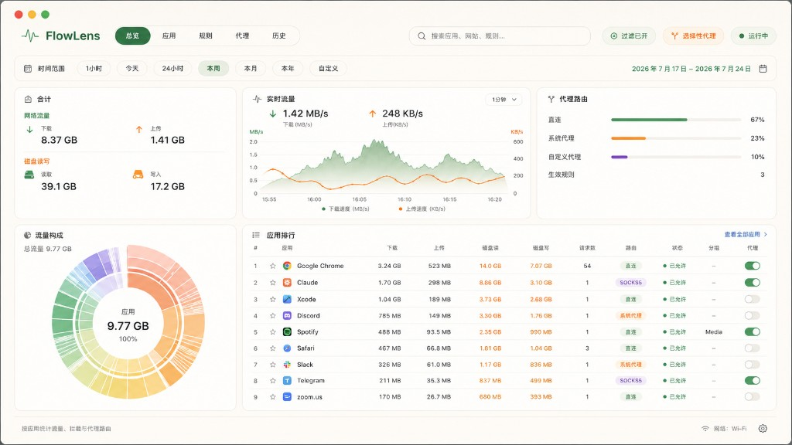
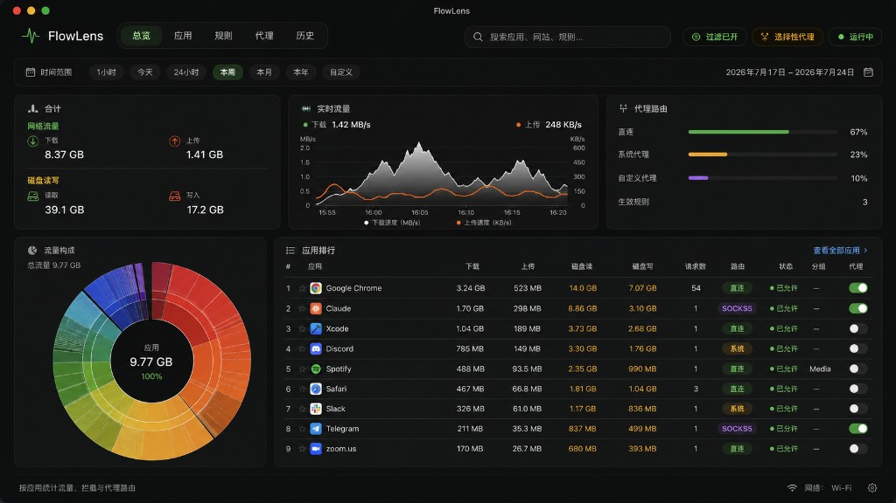

# FlowLens

[English](./README.md) · [简体中文](./README.zh-CN.md)

原生 macOS 网络可观测、按应用防火墙与选择性代理工具。

> 工作代号：正式公开发布前请自行核对商标与域名可用性。

## 截图

<p align="center">
  
</p>

<p align="center">
  
</p>

总览面板：时段合计、实时流量、代理路由占比、流量构成 sunburst，以及按应用排行（收藏、分组、选择性代理）。

## 功能（v0.1）

- **按应用流量** — 实时速率、合计、历史汇总（今天 / 本周 / 本月 / 近 30 天）
- **直连 vs 代理网速** — 菜单栏迷你图按路径拆分上下行与占比
- **选择性代理** — 按应用与命名分组路由（直连 / 系统代理 / SOCKS5 · HTTP CONNECT）
- **原生技术栈** — SwiftUI + AppKit 宿主，System Extension（Filter + Transparent Proxy）
- **隐私优先** — 仅元数据与计数；不抓取载荷、不做 TLS 中间人解密
- **面向 Agent 的 CLI** — JSON 输出，便于脚本与编程助手（`docs/CLI.md`）
- **应用内更新** — 自动检查 [GitHub Releases](https://github.com/Johnnydaszhu/FlowLens/releases)；左下角版本号可手动检查 / 下载

## 下载 / DMG

安装包以 `FlowLens-<version>.dmg` 发布在 GitHub Releases。

```bash
# 本地打 DMG → dist/
./scripts/build-dmg.sh

# 本地打 DMG 并发布 Release（需 gh 登录）
./scripts/publish-release.sh 0.1.0

# 或推送 tag，由 Actions 自动构建并上传 DMG
git tag -a v0.1.0 -m "FlowLens 0.1.0"
git push origin v0.1.0
```

说明见 [`docs/RELEASE.md`](docs/RELEASE.md)。CI 默认为 ad-hoc 签名（演示遥测）；Developer ID 与公证见该文档。

## 快速开始

```bash
# 单元测试（Core / RuleEngine / Storage）— 无需签名
swift test

# Agent / 脚本 CLI（推荐 --json）
swift run flowlens --json status
swift run flowlens --json apps --period week
swift run flowlens --json evaluate --app com.google.Chrome --host github.com
# 完整约定见 docs/CLI.md · AGENTS.md

# 生成 Xcode 工程并构建宿主 App
brew install xcodegen   # 仅需一次
xcodegen generate
xcodebuild -project FlowLens.xcodeproj -scheme FlowLens \
  -configuration Debug CODE_SIGN_IDENTITY="-" CODE_SIGNING_REQUIRED=NO build
```

未安装或未签名系统扩展时，宿主会使用 **演示遥测数据**，总览与菜单栏下拉仍可开发调试。CLI 使用相同纯包与确定性 demo 种子，可离线给 Agent 使用。

## 仓库结构

| 路径 | 说明 |
|---|---|
| `Packages/FlowLensCore` | 身份、流、计数与内存聚合 |
| `Packages/FlowLensRuleEngine` | 规则、分组、快照评估 API |
| `Packages/FlowLensStorage` | SQLite WAL 遥测存储 |
| `Packages/FlowLensIPC` | 宿主 ↔ 扩展消息 |
| `Packages/FlowLensProxyCore` | 代理路由辅助 / 配置 |
| `App/FlowLens` | 宿主 UI（面板 + 菜单栏） |
| `NetworkExtension` | Filter + Transparent Proxy 提供者 |
| `Sources/FlowLensCLI` | `flowlens` 命令行 |
| `schema/` | SQL 草案 |
| `docs/` | 规格、ADR、Xcode 引导、CLI |
| `examples/` | 早期设计骨架（仅参考） |

## 文档

1. 规格：[`FlowLens_macOS_原生网络工具开发规格_v0.1.md`](./FlowLens_macOS_原生网络工具开发规格_v0.1.md)
2. Phase 0 API 校准：[`docs/PHASE0_API_SPIKE.md`](./docs/PHASE0_API_SPIKE.md)
3. 双计数与关联：[`docs/DOUBLE_COUNTING_AND_CORRELATION.md`](./docs/DOUBLE_COUNTING_AND_CORRELATION.md)
4. Xcode 从零搭建：[`docs/XCODE_BOOTSTRAP.md`](./docs/XCODE_BOOTSTRAP.md)
5. 贡献指南：[`CONTRIBUTING.md`](./CONTRIBUTING.md)
6. 发布 / DMG：[`docs/RELEASE.md`](./docs/RELEASE.md)
7. 英文 README（默认）：[`README.md`](./README.md)

## 系统扩展

单个 `.systemextension` 内嵌两类 Provider：

- `FlowFilterDataProvider` — 观察 / 统计 / 允许 / 阻断（默认 fail-open 放行）
- `FlowTransparentProxyProvider` — 选择性代理（默认关闭；未 claim 的 flow 交回系统）

真实抓包需要开发者 Team、匹配的 App Group、[`config/`](config/) 下的 entitlement，以及用户在「系统设置」中的批准。签名限制见 [CONTRIBUTING.md](./CONTRIBUTING.md)。

## 许可

[MIT](./LICENSE) — 可自由使用、修改与再分发，保留版权与许可声明即可。

若希望保持 MIT 兼容，请 **不要** 将 GPL 许可代码（例如 LuLu）并入本仓库。可研究公开架构思想，实现须保持干净室。
